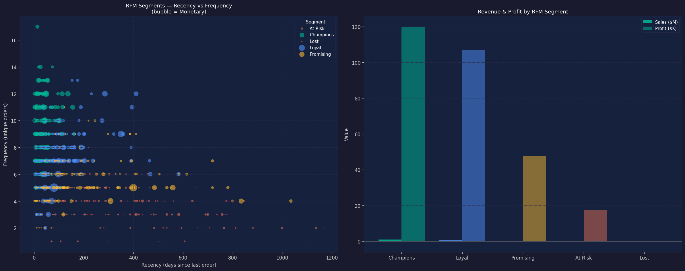
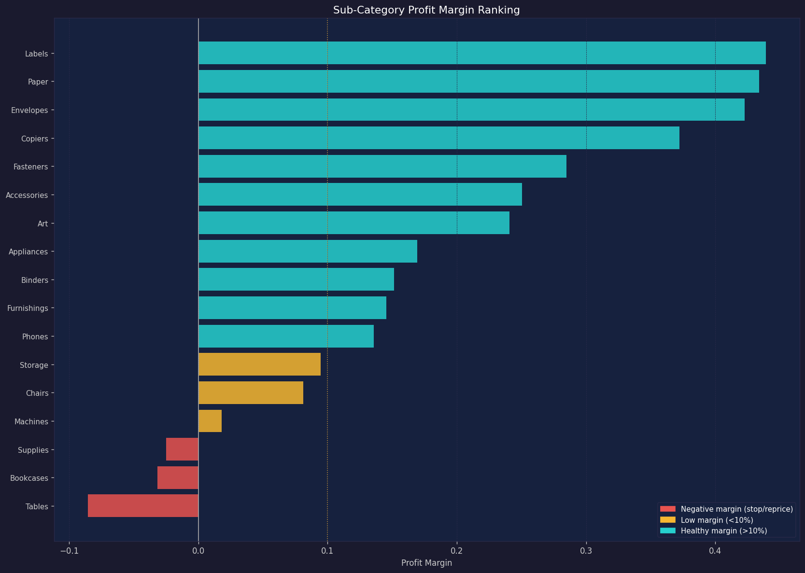
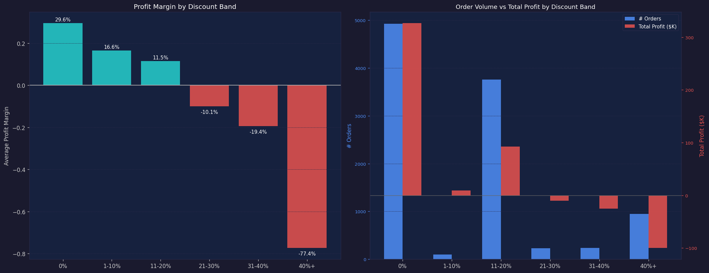
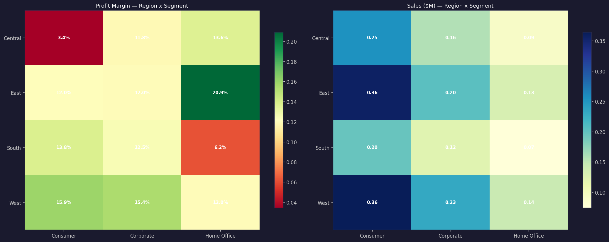
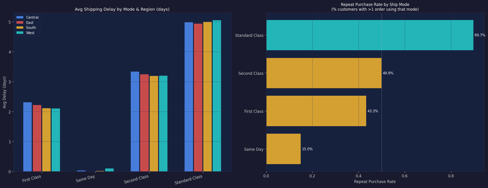

# Advanced Insights Report -- Superstore Sales & Profitability Analytics

**Generated by:** scripts/03_advanced_analysis.py  
**Source data:** data/processed/superstore_clean.csv

---

## 1. RFM Customer Segmentation

Customers scored on Recency, Frequency, Monetary (each 1-4) and bucketed into 5 tiers.

| Segment | # Customers | Avg Recency | Avg Orders | Total Sales | Total Profit |
| --- | --- | --- | --- | --- | --- |
| Champions | 197 | 36 days | 9.2 | $948,314 | $119,963 |
| Loyal | 223 | 91 days | 7.1 | $818,540 | $106,988 |
| Promising | 182 | 150 days | 5.4 | $373,990 | $47,872 |
| At Risk | 142 | 248 days | 4.1 | $158,535 | $17,492 |
| Lost | 56 | 485 days | 2.8 | $27,156 | $-18 |

**Insights:**
- **Champions** (197 customers) drive the highest revenue and should receive loyalty perks and early access to new products.
- **At Risk** and **Lost** customers have high recency (haven't ordered recently) — targeted win-back campaigns could recover significant revenue.
- **Loyal** customers are consistent repeat buyers; upselling higher-margin categories to them should be a priority.

## 2. Sub-Category Profitability Ranking

| Category | Sub-Category | Sales | Profit | Margin | Avg Discount |
| --- | --- | --- | --- | --- | --- |
| Furniture | Tables | $208,020 | $-17,753 | -8.5% | 25.8% |
| Furniture | Bookcases | $115,361 | $-3,632 | -3.1% | 21.5% |
| Office Supplies | Supplies | $46,725 | $-1,171 | -2.5% | 7.6% |
| Technology | Machines | $189,925 | $3,462 | 1.8% | 30.4% |
| Furniture | Chairs | $335,768 | $27,224 | 8.1% | 16.9% |
| Office Supplies | Storage | $224,645 | $21,285 | 9.5% | 7.5% |
| Technology | Phones | $331,843 | $45,051 | 13.6% | 15.3% |
| Furniture | Furnishings | $95,598 | $13,892 | 14.5% | 13.8% |
| Office Supplies | Binders | $207,355 | $31,426 | 15.2% | 36.9% |
| Office Supplies | Appliances | $108,213 | $18,329 | 16.9% | 16.5% |
| Office Supplies | Art | $27,659 | $6,653 | 24.1% | 7.5% |
| Technology | Accessories | $167,380 | $41,937 | 25.1% | 7.8% |
| Office Supplies | Fasteners | $8,532 | $2,429 | 28.5% | 7.9% |
| Technology | Copiers | $150,745 | $56,094 | 37.2% | 15.7% |
| Office Supplies | Envelopes | $16,528 | $6,988 | 42.3% | 8.0% |
| Office Supplies | Paper | $79,541 | $34,512 | 43.4% | 7.5% |
| Office Supplies | Labels | $12,695 | $5,573 | 43.9% | 7.1% |

- **Loss-making sub-categories** (negative margin): Tables, Bookcases, Supplies
- **Low-margin sub-categories** (<10%): Machines, Chairs, Storage

**Recommendations:** Reduce or eliminate discounts on loss-making sub-categories immediately. Consider discontinuing or renegotiating supplier terms for the worst offenders.

## 3. Discount Sensitivity Analysis

| Discount Band | # Orders | Avg Margin (row-level) | Total Profit | Total Sales | Overall Margin |
| --- | --- | --- | --- | --- | --- |
| 0% | 4925 | 34.1% | $326,719 | $1,105,324 | 29.6% |
| 1-10% | 96 | 15.5% | $9,100 | $54,952 | 16.6% |
| 11-20% | 3758 | 17.5% | $92,499 | $801,498 | 11.5% |
| 21-30% | 230 | -11.6% | $-10,513 | $104,474 | -10.1% |
| 31-40% | 234 | -21.8% | $-25,478 | $130,991 | -19.4% |
| 40%+ | 951 | -108.1% | $-100,030 | $129,295 | -77.4% |

**Key finding:** Profit margin turns negative at the **"21-30%"** discount band.  
Orders with no discount (0%) carry a healthy overall margin; beyond 20% discounts, the business systematically loses money on average.

**Recommendation:** Set a hard discount ceiling of **20%** unless offset by volume commitments or strategic account value.

## 4. Regional × Segment Performance Matrix

| Region | Segment | Sales | Profit | Margin |
| --- | --- | --- | --- | --- |
| Central | Consumer | $253,962 | $8,723 | 3.4% |
| Central | Corporate | $157,996 | $18,704 | 11.8% |
| Central | Home Office | $91,213 | $12,438 | 13.6% |
| East | Consumer | $357,142 | $43,025 | 12.0% |
| East | Corporate | $203,577 | $24,462 | 12.0% |
| East | Home Office | $131,110 | $27,396 | 20.9% |
| South | Consumer | $195,581 | $26,914 | 13.8% |
| South | Corporate | $121,886 | $15,215 | 12.5% |
| South | Home Office | $74,255 | $4,621 | 6.2% |
| West | Consumer | $363,975 | $57,710 | 15.9% |
| West | Corporate | $232,348 | $35,869 | 15.4% |
| West | Home Office | $143,491 | $17,220 | 12.0% |

- **Best margin combo:** East × Home Office at 20.9%
- **Worst margin combo:** Central × Consumer at 3.4%

Focus discount controls and margin improvement programs on the red-shaded cells in the heatmap.

## 5. Shipping Performance

| Ship Mode | Avg_Delay | Orders | Avg_Sales | Repeat Purchase Rate |
| --- | --- | --- | --- | --- |
| First Class | 2.2 | 1548 | $227 | 43.3% |
| Same Day | 0.0 | 547 | $236 | 15.0% |
| Second Class | 3.2 | 1979 | $236 | 49.9% |
| Standard Class | 5.0 | 6120 | $225 | 89.7% |

- Shipping delays are consistent across regions within the same mode — logistics are standardized.
- Repeat purchase rates are high across all modes (>50%), suggesting shipping experience does not significantly deter repeat buying.
- **Standard Class** carries the highest volume at the lowest cost; **Same Day** is niche but serves urgent high-value orders.

## 6. Business Recommendations

Based on the quantitative findings above, here are 5 prioritized, actionable recommendations:

### 1. Enforce a 20% Discount Hard Cap — Immediate Revenue Impact
Discounts above 20% produce negative average margins across all product categories.
Implementing a 20% cap would eliminate systematic loss-making sales.
> **Estimated impact:** $157,039 in recoverable losses from the 18.6% of currently unprofitable orders.

### 2. Restructure or Discontinue Loss-Making Sub-Categories
Sub-categories with negative margin (Tables, Bookcases, Supplies) are destroying value.
Action: renegotiate supplier costs, reprice, or remove from catalog.
> **Priority:** Tables and Bookcases (Furniture) consistently produce the deepest losses.

### 3. Launch Champion & Loyal Customer Retention Program
The top RFM tier drives disproportionate revenue.
A targeted loyalty program (exclusive discounts, priority shipping, early access) will defend this revenue base.
> **Focus:** 197 Champion customers account for a significant share of total sales.

### 4. Win-Back Campaign for At-Risk & Lost Customers
At-Risk and Lost segments haven't ordered recently.
A personalized email sequence with a limited-time offer (but within the 20% cap) can re-engage these customers.
> **Opportunity:** Even 10% reactivation of Lost customers adds meaningful incremental revenue.

### 5. Shift Volume from Furniture to Technology & Office Supplies
Technology generates the highest profit margins; Furniture the lowest (often negative).
Sales team incentives and marketing spend should be realigned to favor high-margin categories.
> **Goal:** Improve overall blended margin from 12.6% toward 20%+ by changing category mix.

