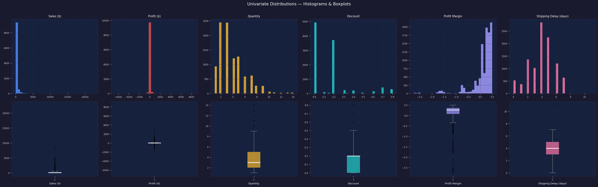
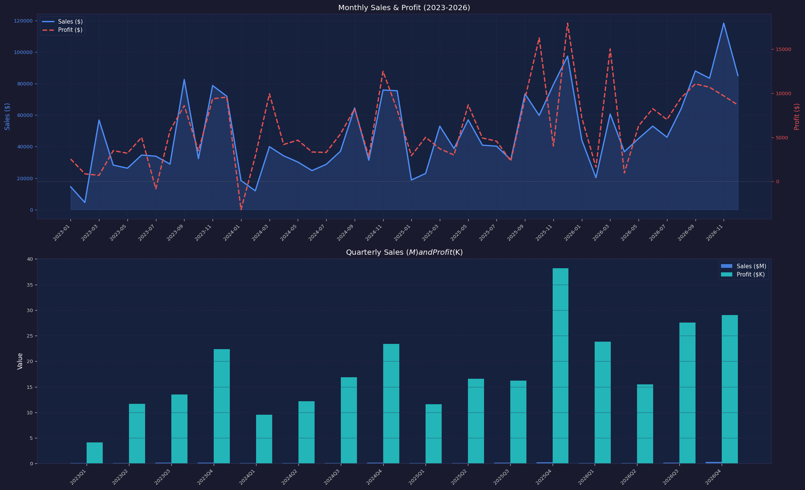
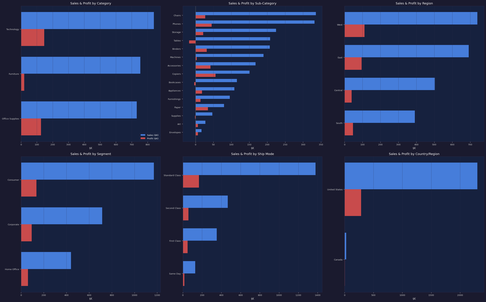
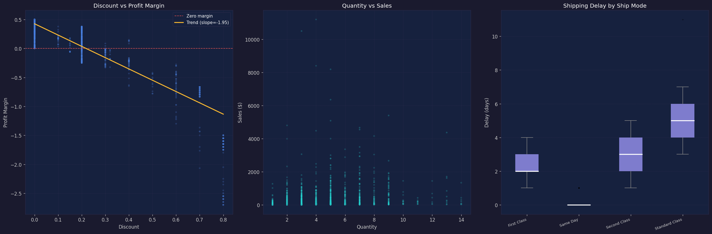
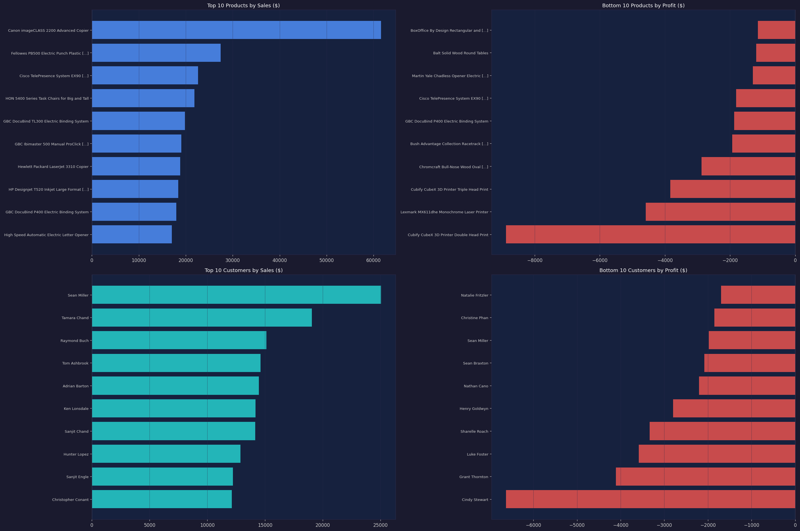
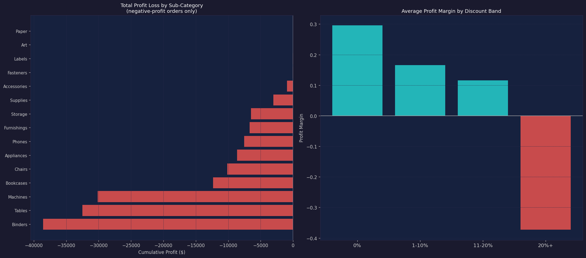

# EDA Report -- Superstore Sales & Profitability Analytics

**Dataset:** 10,194 transactions | Order period: 2023-01-03 to 2026-12-30  
**Generated by:** scripts/02_eda.py

---

## Key Findings

1. **Total Revenue: $2,326,534 | Total Profit: $292,297 | Overall Margin: 12.6%**
2. **18.6% of orders (1,901 rows) are unprofitable**, contributing $-157,039 in cumulative losses.
3. **Discount is the primary profitability lever** -- average margin turns negative at the "20%+" band.
4. **West is the most profitable region** by total profit.
5. **Technology** is the highest-revenue and highest-profit category; **Furniture** (Tables, Bookcases) is the leading loss driver.
6. **Consumer segment** generates the most sales volume; margins are similar across all three segments.
7. **Same Day and First Class shipping** have the shortest and tightest delay distributions.
8. **Sales show consistent YoY growth**; Q4 spikes are visible in every year -- seasonal demand peaks.
9. **Top 10 customers** contribute disproportionately to revenue -- prime candidates for loyalty programs.
10. **Sub-Category "Binders"** carries the largest cumulative loss; urgent discount policy review needed.

---

## 1. Univariate Distributions

| Metric | Min | Median | Mean | Max | Std |
| --- | --- | --- | --- | --- | --- |
| Sales ($) | 0.44 | 53.91 | 228.23 | 22638.48 | 619.91 |
| Profit ($) | -6599.98 | 8.69 | 28.67 | 8399.98 | 232.47 |
| Quantity | 1.00 | 3.00 | 3.79 | 14.00 | 2.23 |
| Discount | 0.00 | 0.20 | 0.16 | 0.80 | 0.21 |
| Profit Margin | -2.75 | 0.27 | 0.12 | 0.50 | 0.46 |
| Shipping Delay (days) | 0.00 | 4.00 | 3.96 | 11.00 | 1.74 |

**Observations:**
- Sales is heavily right-skewed; most orders are small but rare high-value orders pull the mean up.
- Profit spans from deeply negative to highly positive — 18.6% of rows are loss-making.
- Profit Margin floor of -2.75 signals deeply discounted or loss-leader orders.
- Shipping Delay is bounded 0–11 days with a tight median of 4 days.

## 2. Time Series — Monthly & Quarterly Trends

| Year | Sales | Sales YoY | Profit | Profit YoY |
| --- | --- | --- | --- | --- |
| 2023 | $494,040 | (base) | $51,684 | (base) |
| 2024 | $472,993 | -4.3% | $62,021 | +20.0% |
| 2025 | $613,934 | +29.8% | $82,665 | +33.3% |
| 2026 | $745,568 | +21.4% | $95,926 | +16.0% |

## 3. Categorical Breakdowns

### By Category
| Category | Sales ($K) | Profit ($K) |
| --- | --- | --- |
| Technology | 839.9 | 146.5 |
| Furniture | 754.7 | 19.7 |
| Office Supplies | 731.9 | 126.0 |

### By Sub-Category (top 8 by Sales)
| Sub-Category | Sales ($K) | Profit ($K) |
| --- | --- | --- |
| Chairs | 335.8 | 27.2 |
| Phones | 331.8 | 45.1 |
| Storage | 224.6 | 21.3 |
| Tables | 208.0 | -17.8 |
| Binders | 207.4 | 31.4 |
| Machines | 189.9 | 3.5 |
| Accessories | 167.4 | 41.9 |
| Copiers | 150.7 | 56.1 |

### By Region
| Region | Sales ($K) | Profit ($K) |
| --- | --- | --- |
| West | 739.8 | 110.8 |
| East | 691.8 | 94.9 |
| Central | 503.2 | 39.9 |
| South | 391.7 | 46.7 |

### By Segment
| Segment | Sales ($K) | Profit ($K) |
| --- | --- | --- |
| Consumer | 1170.7 | 136.4 |
| Corporate | 715.8 | 94.2 |
| Home Office | 440.1 | 61.7 |

## 4. Correlation Analysis

- **Discount vs Profit Margin**: Pearson r = -0.865. Strong negative relationship; each unit of discount reduces margin by 1.95.
- **Quantity vs Sales**: Weakly positive — bulk orders exist but most orders are small-quantity.
- **Shipping Delay by Ship Mode** (avg days):

| Ship Mode | Avg Delay (days) |
| --- | --- |
| First Class | 2.2 |
| Same Day | 0.0 |
| Second Class | 3.2 |
| Standard Class | 5.0 |

## 5. Top / Bottom Products & Customers

### Top 10 Products by Sales
| Product Name | Sales ($) | Profit ($) |
| --- | --- | --- |
| Canon imageCLASS 2200 Advanced Copier | $61,600 | $25,200 |
| Fellowes PB500 Electric Punch Plastic Comb Binding Machine with Manual Bind | $27,453 | $7,753 |
| Cisco TelePresence System EX90 Videoconferencing Unit | $22,638 | $-1,811 |
| HON 5400 Series Task Chairs for Big and Tall | $21,871 | $0 |
| GBC DocuBind TL300 Electric Binding System | $19,823 | $2,234 |
| GBC Ibimaster 500 Manual ProClick Binding System | $19,024 | $761 |
| Hewlett Packard LaserJet 3310 Copier | $18,840 | $6,984 |
| HP Designjet T520 Inkjet Large Format Printer - 24" Color | $18,375 | $4,095 |
| GBC DocuBind P400 Electric Binding System | $17,965 | $-1,878 |
| High Speed Automatic Electric Letter Opener | $17,030 | $-262 |

### Bottom 10 Products by Profit
| Product Name | Sales ($) | Profit ($) |
| --- | --- | --- |
| Cubify CubeX 3D Printer Double Head Print | $11,100 | $-8,880 |
| Lexmark MX611dhe Monochrome Laser Printer | $16,830 | $-4,590 |
| Cubify CubeX 3D Printer Triple Head Print | $8,000 | $-3,840 |
| Chromcraft Bull-Nose Wood Oval Conference Tables & Bases | $9,918 | $-2,876 |
| Bush Advantage Collection Racetrack Conference Table | $9,545 | $-1,934 |
| GBC DocuBind P400 Electric Binding System | $17,965 | $-1,878 |
| Cisco TelePresence System EX90 Videoconferencing Unit | $22,638 | $-1,811 |
| Martin Yale Chadless Opener Electric Letter Opener | $16,656 | $-1,299 |
| Balt Solid Wood Round Tables | $6,519 | $-1,201 |
| BoxOffice By Design Rectangular and Half-Moon Meeting Room Tables | $1,706 | $-1,148 |

### Top 10 Customers by Sales
| Customer Name | Sales ($) | Profit ($) |
| --- | --- | --- |
| Sean Miller | $25,043 | $-1,981 |
| Tamara Chand | $19,052 | $8,981 |
| Raymond Buch | $15,117 | $6,976 |
| Tom Ashbrook | $14,596 | $4,704 |
| Adrian Barton | $14,474 | $5,445 |
| Ken Lonsdale | $14,175 | $807 |
| Sanjit Chand | $14,142 | $5,757 |
| Hunter Lopez | $12,873 | $5,622 |
| Sanjit Engle | $12,209 | $2,651 |
| Christopher Conant | $12,129 | $2,177 |

### Bottom 10 Customers by Profit
| Customer Name | Sales ($) | Profit ($) |
| --- | --- | --- |
| Cindy Stewart | $5,690 | $-6,626 |
| Grant Thornton | $9,351 | $-4,109 |
| Luke Foster | $3,931 | $-3,584 |
| Sharelle Roach | $3,233 | $-3,334 |
| Henry Goldwyn | $3,248 | $-2,798 |
| Nathan Cano | $2,219 | $-2,205 |
| Sean Braxton | $8,058 | $-2,083 |
| Sean Miller | $25,043 | $-1,981 |
| Christine Phan | $5,888 | $-1,850 |
| Natalie Fritzler | $8,323 | $-1,696 |

## 6. Negative-Profit Deep-Dive

**Total rows with negative profit:** 1,901 (18.6%)  
**Cumulative loss from these rows:** $-157,039

### Loss by Sub-Category (worst 8)
| Sub-Category | # Orders | Total Profit ($) |
| --- | --- | --- |
| Binders | 619 | $-38,563 |
| Tables | 205 | $-32,504 |
| Machines | 44 | $-30,119 |
| Bookcases | 111 | $-12,350 |
| Chairs | 238 | $-10,135 |
| Appliances | 67 | $-8,630 |
| Phones | 136 | $-7,531 |
| Furnishings | 178 | $-6,687 |

### Average Profit Margin by Discount Band
| Discount Band | Profit | Sales | Avg Margin |
| --- | --- | --- | --- |
| 0% | $326,719 | $1,105,324 | 0.296 |
| 1-10% | $9,100 | $54,952 | 0.166 |
| 11-20% | $92,499 | $801,498 | 0.115 |
| 20%+ | $-136,021 | $364,760 | -0.373 |

> Discounts above 20% reliably produce **negative average margins**, confirming deep discounts destroy profitability.

