<div align="center">

# 🚛 Logistics Data Warehouse

### *Transforming Raw Fleet & Shipping Operations Into a Unified Analytics Platform*

**An end-to-end enterprise-grade data warehouse built on a realistic Class 8 trucking dataset — engineered with Medallion Architecture, modular stored procedures, and a Star Schema analytics layer.**

[](https://www.microsoft.com/en-us/sql-server)
[]()
[]()
[]()
[](https://powerbi.microsoft.com/)
[](https://jupyter.org/)
[](LICENSE)

<br>

> 📊 **[Click Here to View the Live Dashboard](https://docs.google.com/spreadsheets/d/1KwzlXp6mJhAZQ7D-3wx9NzWysxX2GLc3MCvLxTdEde0/edit?usp=sharing)** 📊

</div>

---

## 📋 Table of Contents

- [Overview](#overview)
- [Business Context](#business-context)
- [Solution Architecture](#solution-architecture)
- [Dashboard & Analytics](#dashboard--analytics)
- [Entity Relationships](#entity-relationships)
- [Data Flow](#data-flow)
- [Star Schema (Gold Layer)](#star-schema-gold-layer)
- [Data Sources](#data-sources)
- [Project Structure](#project-structure)
- [Prerequisites](#prerequisites)
- [Pipeline Execution](#pipeline-execution)
- [Testing & Data Quality](#testing--data-quality)
- [Business Questions Answered](#business-questions-answered)
- [Engineering Decisions](#engineering-decisions)
- [License](#license)

---

## Overview

The **Logistics Data Warehouse** is a full end-to-end data engineering project for a Class 8 trucking company (2022–2024). It ingests **14 operational CSV files** (~361,000 records), cleanses and standardises them through a layered pipeline, and delivers a dimensional **Star Schema** ready for BI tools and analytical queries.

| Metric | Value |
|---|---|
| **Source Tables** | 14 CSV files |
| **Total Records** | ~361,000 |
| **Pipeline Layers** | 3 (Bronze → Silver → Gold) |
| **Dimension Tables** | 7 |
| **Fact Tables** | 5 |
| **Date Coverage** | 2022 – 2024 |
| **Technology** | Microsoft SQL Server |

---

## Business Context

In logistics, operational data is spread across multiple disconnected systems — fleet management, dispatch, fuel tracking, maintenance logs, and customer contracts. When these remain siloed, operations managers cannot answer even the most basic questions.

**This project solves that problem.**

| Business Problem | Engineering Solution |
|---|---|
| Data scattered across fleet, dispatch & finance systems | Unified ingestion pipeline via the Bronze layer |
| Inconsistent formats, NULLs, and bad data types | Standardisation & cleansing in the Silver layer |
| No analytics-ready model | Star Schema dimensional model in the Gold layer |
| No audit trail for data loads | Per-table timing & row-count output on every run |
| No systematic data quality checks | Dedicated `tests/` directory per layer |

---

## Solution Architecture

The warehouse follows the **Medallion Architecture** (Bronze → Silver → Gold) — a modern layered pattern that ensures data lineage, traceability, and progressive refinement.

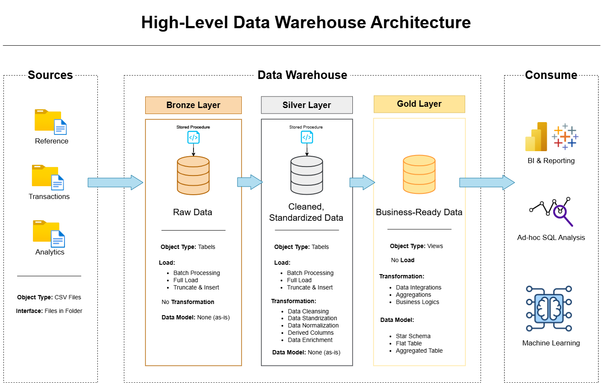

### Layer Responsibilities

```
┌──────────────────────────────────────────────────────────────┐
│                        DATA SOURCES                          │
│   14 CSV files — reference, transaction & pre-aggregated     │
│   (~361,000 records │ 2022–2024 │ USA trucking operations)   │
└────────────────────────┬─────────────────────────────────────┘
                         │
                         ▼
┌──────────────────────────────────────────────────────────────┐
│  🟤 BRONZE  — Raw Ingestion (Schema: bronze)                  │
│  BULK INSERT from CSV │ No transformations │ All columns NULL │
└────────────────────────┬─────────────────────────────────────┘
                         │
                         ▼
┌──────────────────────────────────────────────────────────────┐
│  ⚪ SILVER  — Cleansed & Standardised (Schema: silver)        │
│  Type casting │ Deduplication │ NULL handling │ Audit column  │
└────────────────────────┬─────────────────────────────────────┘
                         │
                         ▼
┌──────────────────────────────────────────────────────────────┐
│  🟡 GOLD  — Business-Ready Star Schema (Schema: gold)         │
│  Dimension tables │ Fact tables │ Surrogate keys │ KPIs       │
└──────────────────────────────────────────────────────────────┘
```

---

## Dashboard & Analytics

The culmination of this data warehouse is a comprehensive **Executive Dashboard** providing real-time insights into fleet operations, financial performance, and customer metrics.

### 📊 Google Sheets Dashboard

The interactive dashboard is built in Google Sheets using the Gold Layer data.

**➡️ [View Live Dashboard](https://docs.google.com/spreadsheets/d/1KwzlXp6mJhAZQ7D-3wx9NzWysxX2GLc3MCvLxTdEde0/edit?usp=sharing)**

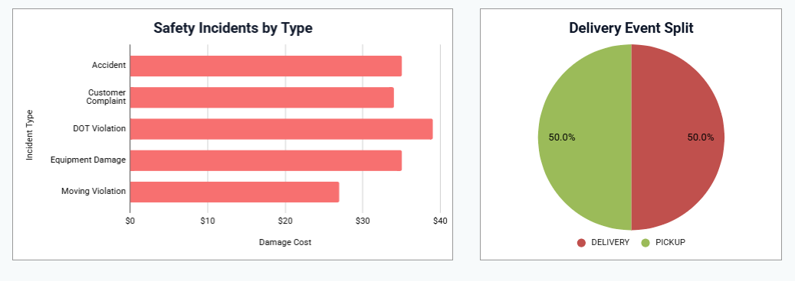
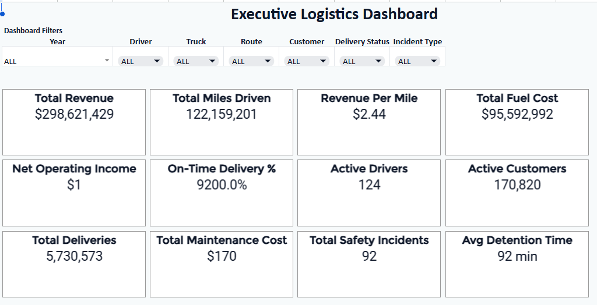
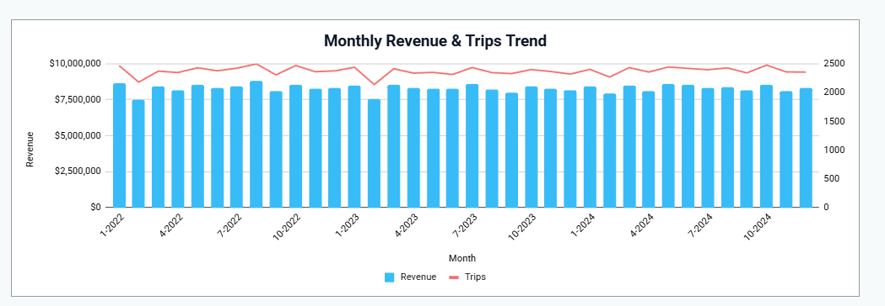
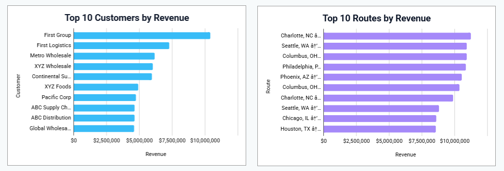
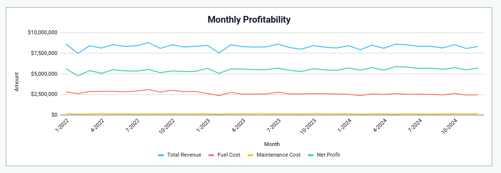
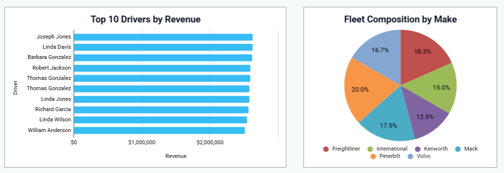
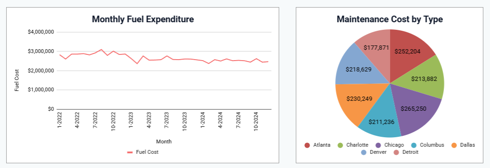
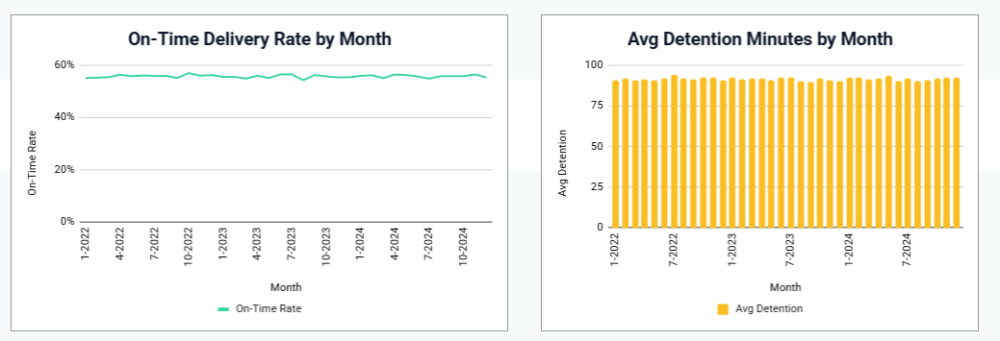

### 📈 Power BI Integration

This repository includes a full Power BI project (`.pbip` format). The semantic model connects directly to the Gold Layer Star Schema:

| Directory | Contents |
|---|---|
| `dashboard.Report/` | Visual layout and design configurations |
| `dashboard.SemanticModel/` | Analytical data model and DAX measures |

### 🗂️ Additional Outputs

| File | Description |
|---|---|
| `logistics_dashboard.html` | HTML Executive Dashboard preview with KPIs (Revenue, Margins, On-time Delivery) |
| `logistics_analysis.ipynb` | Jupyter Notebook with exploratory data analysis |
| `schema_documentation.html` | Interactive ER Diagram browser |
| `logistics_dwh_gold.xlsx` | Exported Gold Layer data (Excel) |
| `docs/DASHBOARD_PRESENTATION.md` | Full breakdown of insights, KPIs & business recommendations |

---

## Entity Relationships

The diagram below maps all foreign-key relationships across the 14 source tables — showing how drivers, trucks, loads, trips, and customers interconnect.

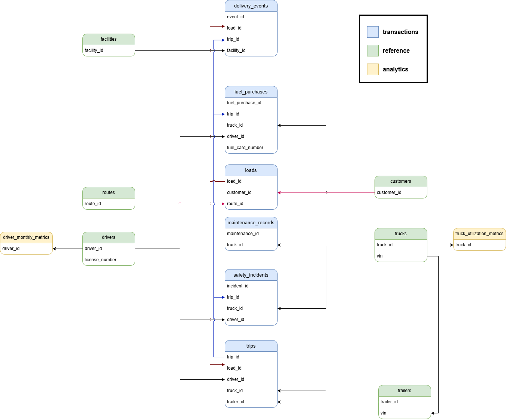

> 💡 For an interactive view of the final Star Schema, open [`schema_documentation.html`](schema_documentation.html) in your browser.

---

## Data Flow

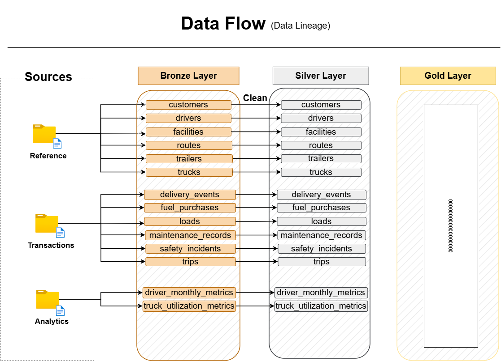

```
[Source CSVs — 14 tables]
        │
        ▼  BULK INSERT → bronze.load_bronze
[Bronze Tables] ── Raw, untransformed, exact replica of source
        │
        ▼  ETL stored procedures → silver.load_silver
[Silver Tables] ── Cleansed, typed, deduplicated + dwh_create_date audit column
        │
        ▼  Business logic JOINs + surrogate key generation → gold.load_gold
[Gold Layer]    ── Star Schema: 7 dimensions + 5 fact tables
```

---

## Star Schema (Gold Layer)

The Gold layer implements a **Star Schema** dimensional model optimised for analytical queries. All dimension tables use **surrogate keys** (`INT IDENTITY`) for fast joins, while retaining natural keys for traceability.

### Dimension Tables

| Table | Source | Primary Key | Enrichments |
|---|---|---|---|
| `gold.dim_driver` | `silver.drivers` | `driver_key` (surrogate), `driver_id` (natural) | `full_name` = first + last |
| `gold.dim_truck` | `silver.trucks` | `truck_key`, `truck_id` | `truck_age_years` = current year − model year |
| `gold.dim_trailer` | `silver.trailers` | `trailer_key`, `trailer_id` | — |
| `gold.dim_customer` | `silver.customers` | `customer_key`, `customer_id` | — |
| `gold.dim_facility` | `silver.facilities` | `facility_key`, `facility_id` | — |
| `gold.dim_route` | `silver.routes` | `route_key`, `route_id` | `lane_description` = origin → destination |
| `gold.dim_date` | Generated (2020–2030) | `date_key` (YYYYMMDD) | year, quarter, month, week, day, is_weekend |

### Fact Tables

| Table | Grain | Dimension Keys | Key Measures |
|---|---|---|---|
| `gold.fact_trip` | One trip | driver, truck, trailer, customer, route, date | revenue, total_revenue, distance, duration, fuel, MPG |
| `gold.fact_fuel_purchase` | One transaction | driver, truck, date | gallons, price_per_gallon, total_cost |
| `gold.fact_maintenance` | One service record | truck, date | labor_cost, parts_cost, total_cost, downtime_hours |
| `gold.fact_safety` | One incident | driver, truck, date | vehicle_damage_cost, cargo_damage_cost, total_damage_cost, claim_amount |
| `gold.fact_delivery` | One pickup/delivery | facility | detention_minutes, on_time_flag |

---

## Data Sources

> **Source:** [Kaggle — Logistics Operations Database (2022–2024)](https://www.kaggle.com/) by Yogape Rodriguez (MIT License)
> Full details → [`docs/DATASET_OVERVIEW.md`](docs/DATASET_OVERVIEW.md)

### Reference (Dimension) Tables

| Table | Description | Key Columns |
|---|---|---|
| `drivers` | Driver demographics, license, employment | `driver_id`, `cdl_class`, `employment_status`, `years_experience` |
| `trucks` | Fleet equipment, acquisition, status | `truck_id`, `make`, `model`, `year`, `status` |
| `trailers` | Trailer inventory, types, dimensions | `trailer_id`, `trailer_type`, `capacity` |
| `customers` | Customer accounts, contract types | `customer_id`, `contract_type`, `credit_limit` |
| `facilities` | Terminal & warehouse locations | `facility_id`, `facility_type`, `state` |
| `routes` | Origin-destination pairs, rates, distances | `route_id`, `origin`, `destination`, `distance_miles` |

### Transaction Tables

| Table | Description | Key Columns |
|---|---|---|
| `loads` | Shipment bookings & revenue | `load_id`, `customer_id`, `route_id`, `revenue` |
| `trips` | Trip execution, fuel, distance | `trip_id`, `load_id`, `driver_id`, `truck_id`, `actual_miles` |
| `fuel_purchases` | Fuel transactions & prices | `purchase_id`, `truck_id`, `gallons`, `price_per_gallon` |
| `maintenance_records` | Service history & costs | `record_id`, `truck_id`, `maintenance_type`, `total_cost` |
| `delivery_events` | Pickup/delivery timestamps, on-time status | `event_id`, `load_id`, `on_time_flag` |
| `safety_incidents` | Accidents, violations, damage costs | `incident_id`, `driver_id`, `incident_type`, `damage_cost` |

### Pre-Aggregated Analytics Tables

| Table | Description |
|---|---|
| `driver_monthly_metrics` | Monthly driver KPI snapshots |
| `truck_utilization_metrics` | Monthly truck utilisation summaries |

---

## Project Structure

```text
logistics-data-warehouse/
│
├── datasets/                               # Source CSV files (not tracked in Git)
│   ├── reference/                          # Dimension data (drivers, trucks, customers…)
│   ├── transactions/                       # Operational data (trips, loads, fuel…)
│   └── analytics/                          # Pre-aggregated monthly KPIs
│
├── docs/                                   # Technical documentation & diagrams
│   ├── data_architecture.png               # Medallion architecture overview
│   ├── data_flow.png                       # End-to-end pipeline data flow
│   ├── entity_relationships.png            # Entity-relationship diagram
│   ├── DASHBOARD_PRESENTATION.md           # Dashboard KPIs, insights & recommendations
│   ├── DATASET_OVERVIEW.md                 # Dataset source, structure & use cases
│   ├── DATABASE_SCHEMA.txt                 # Table schemas & key relationships
│   └── PROJECT_GENERATION_PROMPT.md        # AI generation prompt reference
│
├── scripts/                                # All SQL pipeline scripts
│   ├── init_database.sql                   # Database & schema bootstrap (run once)
│   │
│   ├── bronze/                             # 🟤 Bronze Layer — Raw Ingestion
│   │   ├── 01_create_reference.sql         # DDL: reference tables
│   │   ├── 02_create_transactions.sql      # DDL: transaction tables
│   │   ├── 03_create_analytics.sql         # DDL: analytics tables
│   │   ├── 04_load_reference.sql           # SP: load reference data
│   │   ├── 05_load_transactions.sql        # SP: load transaction data
│   │   ├── 06_load_analytics.sql           # SP: load analytics data
│   │   └── 07_load_bronze_layer.sql        # SP: master orchestrator (bronze.load_bronze)
│   │
│   ├── silver/                             # ⚪ Silver Layer — Cleanse & Standardise
│   │   ├── 01_create_reference.sql         # DDL: cleansed reference tables
│   │   ├── 02_create_transactions.sql      # DDL: cleansed transaction tables
│   │   ├── 03_create_analytics.sql         # DDL: cleansed analytics tables
│   │   ├── 04_load_drivers.sql             # SP: cleanse & load drivers
│   │   ├── 05_load_customers.sql           # SP: cleanse & load customers
│   │   ├── 06_load_facilities.sql          # SP: cleanse & load facilities
│   │   ├── 07_load_routes.sql              # SP: cleanse & load routes
│   │   ├── 08_load_trailers.sql            # SP: cleanse & load trailers
│   │   ├── 09_load_trucks.sql              # SP: cleanse & load trucks
│   │   ├── 10_load_delivery_events.sql     # SP: cleanse & load delivery events
│   │   ├── 11_load_fuel_purchases.sql      # SP: cleanse & load fuel purchases
│   │   ├── 12_load_loads.sql               # SP: cleanse & load loads
│   │   ├── 13_load_maintenance_records.sql # SP: cleanse & load maintenance
│   │   ├── 14_load_safety_incidents.sql    # SP: cleanse & load safety incidents
│   │   ├── 15_load_trips.sql               # SP: cleanse & load trips
│   │   ├── 16_load_driver_monthly_metrics.sql  # SP: cleanse & load driver KPIs
│   │   ├── 17_load_truck_utilization_metrics.sql # SP: cleanse & load truck KPIs
│   │   └── 18_load_silver_layer.sql        # SP: master orchestrator (silver.load_silver)
│   │
│   └── gold/                               # 🟡 Gold Layer — Star Schema
│       ├── 01_create_dimensions.sql        # DDL: 7 dimension tables
│       ├── 02_create_facts.sql             # DDL: 5 fact tables
│       ├── 03_load_dimensions.sql          # SP: populate all dimensions
│       ├── 04_load_facts.sql               # SP: populate all facts
│       └── 05_load_gold_layer.sql          # SP: master orchestrator (gold.load_gold)
│
├── tests/                                  # Data quality & validation scripts
│   ├── silver/                             # Silver layer quality checks (16 scripts)
│   │   ├── 01_exploration.sql              # Bronze layer profiling
│   │   ├── 02_quality_checks_drivers.sql
│   │   ├── 03_quality_checks_customers.sql
│   │   └── … (one script per source table)
│   └── gold/                               # Gold layer validation (2 scripts)
│       ├── 01_quality_checks_dimensions.sql
│       └── 02_quality_checks_facts.sql
│
├── dashboard.Report/                       # Power BI Report layout files
├── dashboard.SemanticModel/                # Power BI Semantic Model (TMDL + DAX)
├── logistics_dashboard.html               # Executive Dashboard HTML preview
├── logistics_analysis.ipynb               # Exploratory Data Analysis notebook
├── logistics_dwh_gold.xlsx                # Exported Gold Layer data (Excel)
├── schema_documentation.html             # Interactive ER Diagram
└── README.md                              # This file
```

---

## Prerequisites

Before running the pipeline, ensure the following are in place:

| Requirement | Details |
|---|---|
| **SQL Server** | Microsoft SQL Server 2019+ (or Express) |
| **SQL Server Management Studio** | SSMS 18+ (recommended) |
| **CSV Data Files** | 14 source files placed in the `datasets/` directory |
| **File Path Configuration** | Update `BULK INSERT` paths in bronze load scripts to match your local `datasets/` directory |

> ⚠️ **Important:** The `datasets/` folder is excluded from Git (`.gitignore`). You must obtain the source CSV files separately from [Kaggle](https://www.kaggle.com/) and place them in the correct subfolders before running the pipeline.

---

## Pipeline Execution

Execute the pipeline **sequentially** — each layer depends on the previous one. All steps are idempotent and safe to re-run.

### Step 0 — Database Initialisation

> ⚠️ **Warning:** This script **drops and recreates** the `logistics_dwh` database. Run only once.

```sql
:r scripts/init_database.sql
```

---

### Step 1 — 🟤 Bronze Layer (Raw Ingestion)

Register the DDL and stored procedures:

```sql
-- Create bronze table schemas
:r scripts/bronze/01_create_reference.sql
:r scripts/bronze/02_create_transactions.sql
:r scripts/bronze/03_create_analytics.sql

-- Register load stored procedures
:r scripts/bronze/04_load_reference.sql
:r scripts/bronze/05_load_transactions.sql
:r scripts/bronze/06_load_analytics.sql
:r scripts/bronze/07_load_bronze_layer.sql
```

Execute the full Bronze pipeline:

```sql
EXEC bronze.load_bronze;
```

**What happens:** All 14 tables are bulk-loaded from CSV with **zero transformation**. Per-table row counts and execution times are printed. Any re-run will truncate and reload (fully idempotent).

---

### Step 2 — ⚪ Silver Layer (Cleanse & Standardise)

Register the DDL and stored procedures:

```sql
-- Create silver table schemas
:r scripts/silver/01_create_reference.sql
:r scripts/silver/02_create_transactions.sql
:r scripts/silver/03_create_analytics.sql

-- Register all 14 table load stored procedures
:r scripts/silver/04_load_drivers.sql
:r scripts/silver/05_load_customers.sql
:r scripts/silver/06_load_facilities.sql
:r scripts/silver/07_load_routes.sql
:r scripts/silver/08_load_trailers.sql
:r scripts/silver/09_load_trucks.sql
:r scripts/silver/10_load_delivery_events.sql
:r scripts/silver/11_load_fuel_purchases.sql
:r scripts/silver/12_load_loads.sql
:r scripts/silver/13_load_maintenance_records.sql
:r scripts/silver/14_load_safety_incidents.sql
:r scripts/silver/15_load_trips.sql
:r scripts/silver/16_load_driver_monthly_metrics.sql
:r scripts/silver/17_load_truck_utilization_metrics.sql
:r scripts/silver/18_load_silver_layer.sql
```

Execute the full Silver pipeline:

```sql
EXEC silver.load_silver;
```

**What happens:** Each of the 14 Bronze tables is cleansed and promoted to Silver with:

| Transformation | Description |
|---|---|
| `TRIM` | Leading/trailing whitespace removed from all string columns |
| `UPPER` | Standardised state codes, VINs, status flags |
| `ROW_NUMBER()` | Deduplication on primary (and composite) keys |
| Range validation | Negative numeric values converted to `NULL` |
| `dwh_create_date` | Audit timestamp added to every record |

---

### Step 3 — 🟡 Gold Layer (Star Schema)

Register the DDL and stored procedures:

```sql
-- Create dimension and fact table schemas
:r scripts/gold/01_create_dimensions.sql
:r scripts/gold/02_create_facts.sql

-- Register load stored procedures
:r scripts/gold/03_load_dimensions.sql
:r scripts/gold/04_load_facts.sql
:r scripts/gold/05_load_gold_layer.sql
```

Execute the full Gold pipeline:

```sql
EXEC gold.load_gold;
```

**What happens:** 7 dimension tables are populated from Silver (including a generated date dimension spanning **2020–2030**), then 5 fact tables are loaded by JOINing Silver transactional data with dimension surrogate keys. Derived measures such as `total_revenue` and `total_damage_cost` are computed during load.

---

### 🚀 Full End-to-End Pipeline Refresh

Once all scripts have been registered, the **entire warehouse** can be refreshed with three commands:

```sql
EXEC bronze.load_bronze;
EXEC silver.load_silver;
EXEC gold.load_gold;
```

---

## Testing & Data Quality

Data quality is a **first-class engineering concern** in this project. Every source table has a corresponding validation script that runs before data is promoted to the next layer.

### Quality Check Dimensions

| Dimension | Checks Performed |
|---|---|
| **Completeness** | NULL checks on mandatory fields (IDs, dates, names) |
| **Uniqueness** | Duplicate detection on primary and composite keys |
| **Validity** | Date logic, negative value detection, format validation |
| **Consistency** | Trimming, standardisation of categorical values |
| **Range** | Min/max sanity checks on numeric and date columns |
| **Referential Integrity** | Orphaned foreign key detection (Gold layer) |
| **Reconciliation** | Silver-to-Gold row count matching |

### Test Coverage

#### Silver Layer Tests (`tests/silver/`)

| Script | Table Covered |
|---|---|
| `01_exploration.sql` | Bronze layer — overall profiling |
| `02_quality_checks_drivers.sql` | `bronze.drivers` |
| `03_quality_checks_customers.sql` | `bronze.customers` |
| `04_explore_customer_type.sql` | `bronze.customers` — type distribution |
| `05_quality_checks_facilities.sql` | `bronze.facilities` |
| `06_quality_checks_routes.sql` | `bronze.routes` |
| `07_quality_checks_trailers.sql` | `bronze.trailers` |
| `08_quality_checks_trucks.sql` | `bronze.trucks` |
| `09_quality_checks_delivery_events.sql` | `bronze.delivery_events` |
| `10_quality_checks_fuel_purchases.sql` | `bronze.fuel_purchases` |
| `11_quality_checks_loads.sql` | `bronze.loads` |
| `12_quality_checks_maintenance_records.sql` | `bronze.maintenance_records` |
| `13_quality_checks_safety_incidents.sql` | `bronze.safety_incidents` |
| `14_quality_checks_trips.sql` | `bronze.trips` |
| `15_quality_checks_driver_monthly_metrics.sql` | `bronze.driver_monthly_metrics` |
| `16_quality_checks_truck_utilization_metrics.sql` | `bronze.truck_utilization_metrics` |

#### Gold Layer Tests (`tests/gold/`)

| Script | Coverage |
|---|---|
| `01_quality_checks_dimensions.sql` | All 7 dimension tables |
| `02_quality_checks_facts.sql` | All 5 fact tables |

---

## Business Questions Answered

This warehouse is designed to answer the following operational and strategic questions:

- 🏆 Which drivers have the **highest on-time delivery rates**?
- 💰 Which **routes are the most profitable** by revenue and margin?
- 🔧 How does **truck age** affect maintenance costs and downtime?
- ⛽ What is the **average fuel cost per trip** by route and driver?
- 🤝 Which **customers generate the highest revenue**, and what are their contract types?
- 📅 How do **seasonal patterns** affect load volumes and freight rates?
- 🚚 What is the **fleet utilisation rate** per truck per month?
- ⚠️ Which **safety incidents** caused the highest financial impact?

---

## Engineering Decisions

### Why Stored Procedures for ETL?

Stored procedures encapsulate transformation logic close to the data — enabling atomic transactions, built-in `TRY/CATCH` error handling, execution timing, and row-count logging. They are version-controlled like application code, making the pipeline auditable and maintainable.

### Why Truncate-and-Load (Not Incremental)?

For a dataset of ~361K rows, a full truncate-and-reload on each run guarantees **idempotency** without the complexity of change-data-capture (CDC) or watermark management. This is the correct engineering trade-off at this scale.

### Why Separate DDL from Load Scripts?

Separating schema creation (`01_create_*.sql`) from data loading (`04_load_*.sql`) means schema changes can be reviewed and deployed independently — load jobs never break due to a DDL modification.

### Why Surrogate Keys in Gold?

Integer surrogate keys (`INT IDENTITY`) are smaller, faster for joins, and independent of source system key changes. Natural keys are **retained alongside** surrogate keys for full traceability and debugging.

### Why a Date Dimension?

A pre-generated calendar table (`gold.dim_date`, spanning 2020–2030) enables time-based grouping (year, quarter, month, day, weekend) without runtime date functions — essential for performant analytical queries and full BI tool compatibility.

### Why a Dedicated Tests Directory?

Separating validation logic from production ETL is a senior engineering discipline. The `tests/` directory provides a reusable audit trail of every data quality decision — invaluable for onboarding new engineers and diagnosing future data issues.

---

## License

This project is open-source under the [MIT License](LICENSE).

---

<div align="center">

**Built with engineering rigor. Designed for logistics intelligence.**

*If you found this project valuable, please consider giving it a ⭐ on GitHub.*

[](https://github.com/adhameltantawi)

</div>
