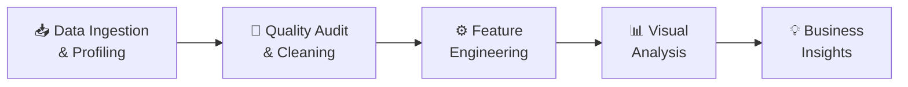

<div align="center">

# 🟠 Orange Internship — Data Analytics & Engineering Portfolio

### *An end-to-end portfolio spanning Exploratory Data Analysis, Advanced Analytics, and Enterprise Data Warehousing*

[](https://www.python.org/)
[](https://www.microsoft.com/en-us/sql-server)
[](https://jupyter.org/)
[](https://powerbi.microsoft.com/)
[](https://github.com/adhameltantawi)

<br>

> 📌 **Author:** Adham El Tantawi &nbsp;|&nbsp; 🗓️ **Year:** 2026 &nbsp;|&nbsp; 🏢 **Program:** Orange Internship — Data Engineering & Analytics Track

</div>

---

## 📋 Table of Contents

- [About This Portfolio](#-about-this-portfolio)
- [Repository Architecture](#-repository-architecture)
- [Projects at a Glance](#-projects-at-a-glance)
- [Project 01 — Superstore Sales EDA](#-project-01--superstore-sales-eda)
- [Project 02 — Students Performance EDA & Web Dashboard](#-project-02--students-performance-eda--web-dashboard)
- [Project 03 — Superstore Analytics Pipeline](#-project-03--superstore-analytics-pipeline)
- [Project 04 — Logistics Data Warehouse](#-project-04--logistics-data-warehouse)
- [Technology Stack](#️-technology-stack)
- [Analytical Methodology](#-analytical-methodology)
- [Getting Started](#-getting-started)
- [Author](#-author)

---

## 📖 About This Portfolio

This repository is the complete deliverable of the **Orange Digital Center Internship — Data Analytics & Data Engineering Track**. It contains **four production-grade projects** progressing from foundational EDA to a full enterprise-grade SQL data warehouse, demonstrating a comprehensive skill set across:

- **Exploratory Data Analysis (EDA)** — structured data profiling, quality auditing, outlier treatment, and visual storytelling
- **Interactive Web Dashboards** — zero-dependency front-end dashboards built with HTML5, CSS3, and Chart.js
- **Advanced Python Analytics** — RFM segmentation, discount sensitivity analysis, profitability modeling, and time-series reporting
- **Enterprise Data Engineering** — Medallion Architecture (Bronze → Silver → Gold), Star Schema dimensional modeling, and modular stored-procedure ETL pipelines

Every project is self-contained with a dedicated dataset, notebook or scripts, documentation, and a visual output.

---

## 📁 Repository Architecture

```
orange_internship/
│
├── README.md                            ← Root portfolio documentation (this file)
│
├── 01_superstore_sales_eda/             ← Project 01: Retail Superstore EDA
│   ├── superstore_sales.csv             #   Raw dataset (~9,800 rows × 18 cols)
│   ├── superstore_sales_eda.ipynb       #   Full EDA notebook
│   └── README.md                        #   Project documentation
│
├── 02_students_performance_eda/         ← Project 02: Students EDA + Web Dashboard
│   ├── students_performance.csv         #   Raw dataset (1,000 rows × 8 cols)
│   ├── students_performance_eda.ipynb   #   Full EDA notebook (Kaggle-published)
│   ├── index.html                       #   Interactive dark-mode Web Dashboard
│   ├── styles.css                       #   Glassmorphism stylesheet
│   ├── app.js                           #   Dashboard logic & Chart.js rendering
│   ├── data.js                          #   Embedded JSON dataset for client-side use
│   └── README.md                        #   Project documentation
│
├── 03_superstore_analytics/             ← Project 03: Advanced Analytics Pipeline
│   ├── data/                            #   raw/ and processed/ CSV files
│   ├── scripts/                         #   Python scripts (cleaning, EDA, advanced)
│   ├── reports/                         #   EDA + advanced insight reports + figures
│   ├── dashboard/                       #   Interactive HTML dashboard + data.json
│   ├── outputs/                         #   Executive summary
│   └── README.md                        #   Project documentation
│
└── 04_logistics_data_warehouse/         ← Project 04: Enterprise Data Warehouse
    ├── scripts/                         #   SQL ETL pipeline (Bronze → Silver → Gold)
    │   ├── init_database.sql            #     Database & schema bootstrap
    │   ├── bronze/                      #     7 scripts: DDL + load SPs
    │   ├── silver/                      #     18 scripts: DDL + 14 table load SPs
    │   └── gold/                        #     5 scripts: DDL + dimension & fact SPs
    ├── tests/                           #   Data quality scripts (silver/ + gold/)
    ├── docs/                            #   Architecture diagrams, data catalog, schemas
    ├── dashboard.Report/                #   Power BI Report layout
    ├── dashboard.SemanticModel/         #   Power BI Semantic Model (TMDL + DAX)
    ├── logistics_analysis.ipynb         #   Exploratory analysis notebook
    ├── logistics_dashboard.html         #   HTML Executive Dashboard
    ├── schema_documentation.html        #   Interactive ER diagram browser
    ├── logistics_dwh_gold.xlsx          #   Exported Gold Layer data
    └── README.md                        #   Full project documentation
```

---

## 🗂️ Projects at a Glance

| # | Project | Domain | Dataset | Key Deliverable | Status |
|---|---|---|---|---|---|
| **01** | Superstore Sales EDA | Retail & E-Commerce | ~9,800 rows × 18 cols | End-to-end EDA Notebook | ✅ Complete |
| **02** | Students Performance EDA | Education & Demographics | 1,000 rows × 8 cols | Notebook + Web Dashboard | ✅ Complete |
| **03** | Superstore Analytics Pipeline | Retail Business Intelligence | ~10,200 rows × 21 cols | Python Pipeline + Interactive Dashboard | ✅ Complete |
| **04** | Logistics Data Warehouse | Supply Chain & Fleet Operations | ~361,000 rows, 14 source tables | Full SQL DWH + Power BI | ✅ Complete |

---

## 📊 Project 01 — Superstore Sales EDA

> **[View Project Documentation →](01_superstore_sales_eda/README.md)**

### Overview

A structured, end-to-end **Exploratory Data Analysis** on a US retail superstore dataset, covering 9,800+ transactions across Furniture, Office Supplies, and Technology categories. The notebook follows a rigorous 4-phase analytical framework from raw data through clean, model-ready output.

### Dataset

| Attribute | Detail |
|---|---|
| **File** | `superstore_sales.csv` |
| **Rows × Columns** | ~9,800 × 18 |
| **Domain** | US Retail Transactions |
| **Key Fields** | Order ID, Ship Mode, Segment, Region, Category, Sub-Category, Sales |

### Analysis Pipeline

| Phase | Description |
|---|---|
| **Phase 1 — Data Profiling** | Schema inspection, `dtypes`, date casting, feature engineering (`Days to Ship`, `Order Month`) |
| **Phase 2 — Descriptive Statistics** | Numerical & categorical summaries, central tendency, cardinality |
| **Phase 3 — Quality Audit & Cleaning** | Null imputation, duplicate removal, whitespace stripping, IQR Winsorization |
| **Phase 4 — Distribution Analysis** | KDE histograms, box plots, bar charts, donut charts, cross-tabulations |

### Key Findings

- **Missing Data:** All 11 null `Postal Code` values belonged to Burlington, VT — resolved with code `05401`.
- **Sales Distribution:** Heavily right-skewed; majority of transactions < $500, extreme outliers > $5,000. Applied IQR Winsorization.
- **Shipping Dominance:** Standard Class accounts for ~60% of all orders (avg. lead time 3–5 days).
- **Category Insights:** Office Supplies leads in transaction volume; Technology leads in average order value.
- **Geography:** California, New York, and Texas are the top three states by order count.

---

## 🎓 Project 02 — Students Performance EDA & Web Dashboard

> **[View Project Documentation →](02_students_performance_eda/README.md)** &nbsp;|&nbsp; [](https://www.kaggle.com/code/adhameltantawi/students-performance-eda-clean-structured-anal)

### Overview

An in-depth statistical analysis of student exam performance paired with a fully self-contained **Interactive Web Dashboard**. The notebook answers 10 targeted business questions with empirical evidence, while the dashboard provides real-time filtering and dynamic chart updates — all without a back-end server.

### Dataset

| Attribute | Detail |
|---|---|
| **File** | `students_performance.csv` |
| **Rows × Columns** | 1,000 × 8 |
| **Domain** | Education & Demographics |
| **Key Fields** | gender, race/ethnicity, parental education, lunch, test preparation, math/reading/writing scores |

**Engineered Features:** `total_score`, `percentage`, `grade` (A–F via `pd.cut`), `result` (Pass/Fail)

### Interactive Web Dashboard

The included `index.html` dashboard features:

| Component | Details |
|---|---|
| **Multi-Dimensional Filters** | Filter by Gender, Ethnicity, Parental Education, Lunch Program, Test Prep, Pass/Fail |
| **Live KPI Cards** | Total Students, Pass Rate, Average Percentage, Subject Means (Math, Reading, Writing) |
| **6 Chart.js Visualizations** | Grade Distribution, Gender Performance, Parental Education Impact, Lunch × Prep Matrix, Ethnicity Scores, Score Range Breakdown |
| **Data Explorer Table** | Searchable, sortable, paginated student records with grade & result badges |

### Key Findings

| Question | Finding |
|---|---|
| Do females outperform males? | Males lead Math (+5 pts); Females lead Reading (+7 pts) & Writing (+9 pts) |
| Does parental education matter? | Yes — clear positive linear trend across all subjects |
| Does test prep help? | Yes — consistent **5–8 point boost** across all demographics |
| What is the strongest predictor? | Lunch type (socio-economic proxy) — **~10–12 point gap** between Standard and Free/Reduced |
| Are Reading & Writing correlated? | Near-perfectly collinear (r ≈ 0.95), indicating shared literacy competencies |
| Are zero scores valid? | Yes — they represent genuinely struggling students, not data errors |

---

## 📈 Project 03 — Superstore Analytics Pipeline

> **[View Project Documentation →](03_superstore_analytics/README.md)** &nbsp;|&nbsp; [](https://docs.google.com/spreadsheets/d/1DzC_F7FBdHq74oyqFFGS8J7uRxDZ4gHD5_RjSmjgjBQ/edit?usp=sharing)

### Overview

A complete **end-to-end analytics pipeline** built entirely in Python, from raw XLSX ingestion through RFM customer segmentation, discount sensitivity analysis, and an interactive single-file web dashboard. The project answers three core business questions:

1. **Where is money being lost** — and why?
2. **Which customers and products** drive the most value?
3. **What levers** can management pull to improve blended margin?

### Dataset

| Attribute | Detail |
|---|---|
| **Source** | `data/raw/ODC_Excel_Task.xlsx` |
| **Sheets** | Orders (10,194 rows × 21 cols), People (4 regional managers), Return (296 returned orders) |
| **Date Range** | 2023-01-03 → 2026-12-30 |
| **Geography** | United States & Canada · 4 Regions · 49 States/Provinces |
| **Customers** | 800 unique · 5,111 orders |

### Pipeline Scripts

| Script | Phase | Output |
|---|---|---|
| `scripts/01_data_cleaning.py` | Read XLSX, feature engineering | `data/processed/superstore_clean.csv` |
| `scripts/02_eda.py` | EDA + 6 charts | `reports/eda_report.md` + 6 PNGs |
| `scripts/03_advanced_analysis.py` | RFM, discount, heatmap | `reports/advanced_insights.md` + 5 PNGs |

### Key Business Findings

| # | Finding | Metric |
|---|---|---|
| 1 | Total 4-year revenue | **$2,326,534** |
| 2 | Total profit (blended margin) | **$292,297 (12.6%)** |
| 3 | Average YoY Sales growth | **+15.7%** |
| 4 | Orders with negative profit | **1,901 (18.6%)** |
| 5 | Returned orders | **296 (5.8%)** |
| 6 | Best-performing region | **West — $110,799 profit** |
| 7 | Discount tipping point | **> 20% discount → –37% avg margin** |
| 8 | Highest-margin category | **Technology — 17.4%** |
| 9 | Lowest-margin category | **Furniture — 2.6%** |
| 10 | Largest cumulative loss | **Binders — –$38,563** |

### Dashboard Features

The `dashboard/superstore_dashboard.html` provides:
- **6 KPI cards**: Total Sales, Profit, Margin %, Orders, AOV, Returned Orders
- **Cross-filters**: Year · Region · Category · Segment
- **Charts**: Monthly Sales & Profit trend, Category breakdowns, Region × Segment heatmap, Top 10 Products scatter, Discount vs. Margin scatter, Shipping performance

---

## 🚛 Project 04 — Logistics Data Warehouse

> **[View Full Project Documentation →](04_logistics_data_warehouse/README.md)** &nbsp;|&nbsp; [](https://docs.google.com/spreadsheets/d/1KwzlXp6mJhAZQ7D-3wx9NzWysxX2GLc3MCvLxTdEde0/edit?usp=sharing)

### Overview

The flagship project of this portfolio. A fully **enterprise-grade SQL Data Warehouse** built on a realistic Class 8 trucking dataset (~361,000 records, 14 source tables). The solution applies **Medallion Architecture** (Bronze → Silver → Gold), modular idempotent **stored-procedure ETL**, and a production-ready **Star Schema** analytical layer backed by Power BI.

### Project Metrics

| Metric | Value |
|---|---|
| **Source Tables** | 14 CSV files |
| **Total Records** | ~361,000 |
| **Pipeline Layers** | 3 (Bronze → Silver → Gold) |
| **ETL Stored Procedures** | 25+ |
| **Dimension Tables** | 7 |
| **Fact Tables** | 5 |
| **Data Quality Tests** | 18 scripts (Silver) + 2 scripts (Gold) |
| **Date Coverage** | 2022 – 2024 |
| **Technology** | Microsoft SQL Server 2019+ |

### Architecture

```
┌──────────────────────────────────────────────────────────────┐
│                        DATA SOURCES                          │
│   14 CSV files — reference, transaction & pre-aggregated     │
│   (~361,000 records │ 2022–2024 │ USA trucking operations)   │
└────────────────────────┬─────────────────────────────────────┘
                         │
                         ▼
┌──────────────────────────────────────────────────────────────┐
│  🟤 BRONZE  — Raw Ingestion (Schema: bronze)                  │
│  BULK INSERT from CSV │ No transformations │ Full audit trail │
└────────────────────────┬─────────────────────────────────────┘
                         │
                         ▼
┌──────────────────────────────────────────────────────────────┐
│  ⚪ SILVER  — Cleansed & Standardised (Schema: silver)        │
│  TRIM │ UPPER │ ROW_NUMBER dedup │ NULL handling │ Audit date │
└────────────────────────┬─────────────────────────────────────┘
                         │
                         ▼
┌──────────────────────────────────────────────────────────────┐
│  🟡 GOLD  — Business-Ready Star Schema (Schema: gold)         │
│  7 Dimensions │ 5 Facts │ Surrogate keys │ Derived KPIs      │
└──────────────────────────────────────────────────────────────┘
```

### Star Schema — Gold Layer

**Dimension Tables**

| Table | Natural Key | Enrichments |
|---|---|---|
| `gold.dim_driver` | `driver_id` | `full_name` = first + last |
| `gold.dim_truck` | `truck_id` | `truck_age_years` = current year − model year |
| `gold.dim_trailer` | `trailer_id` | — |
| `gold.dim_customer` | `customer_id` | — |
| `gold.dim_facility` | `facility_id` | — |
| `gold.dim_route` | `route_id` | `lane_description` = origin → destination |
| `gold.dim_date` | `date_key` (YYYYMMDD) | year, quarter, month, week, day, is_weekend |

**Fact Tables**

| Table | Grain | Key Measures |
|---|---|---|
| `gold.fact_trip` | One trip | revenue, distance, duration, fuel, MPG |
| `gold.fact_fuel_purchase` | One transaction | gallons, price_per_gallon, total_cost |
| `gold.fact_maintenance` | One service record | labor_cost, parts_cost, total_cost, downtime_hours |
| `gold.fact_safety` | One incident | vehicle_damage_cost, cargo_damage_cost, claim_amount |
| `gold.fact_delivery` | One pickup/delivery | detention_minutes, on_time_flag |

### Pipeline Execution

> ⚠️ **Prerequisite:** Run `scripts/init_database.sql` once to bootstrap the database and schemas.

After registering all DDL and stored procedures, execute the full warehouse with three commands:

```sql
EXEC bronze.load_bronze;   -- Ingest from CSV (full truncate-and-reload)
EXEC silver.load_silver;   -- Cleanse & standardise all 14 tables
EXEC gold.load_gold;       -- Build Star Schema (dimensions + facts)
```

Each layer is **fully idempotent** — safe to re-run at any time without side effects.

### Data Quality Framework

| Dimension | Checks Performed |
|---|---|
| **Completeness** | NULL checks on all mandatory fields (IDs, dates, names) |
| **Uniqueness** | Duplicate detection on primary and composite keys |
| **Validity** | Date logic, negative value detection, format validation |
| **Consistency** | TRIM/UPPER standardisation on all categorical fields |
| **Referential Integrity** | Orphaned FK detection across Gold layer facts |
| **Reconciliation** | Silver-to-Gold row count matching |

### Business Questions Answered

- 🏆 Which drivers have the **highest on-time delivery rates**?
- 💰 Which **routes are the most profitable** by revenue and margin?
- 🔧 How does **truck age** correlate with maintenance costs and downtime?
- ⛽ What is the **average fuel cost per trip** by route and driver?
- 🤝 Which **customers generate the highest revenue**, and what are their contract types?
- 📅 How do **seasonal patterns** affect load volumes and freight rates?
- 🚚 What is the **fleet utilisation rate** per truck per month?
- ⚠️ Which **safety incidents** caused the highest financial impact?

### Dashboard & Outputs

| Output | Description |
|---|---|
| [Live Google Sheets Dashboard](https://docs.google.com/spreadsheets/d/1KwzlXp6mJhAZQ7D-3wx9NzWysxX2GLc3MCvLxTdEde0/edit?usp=sharing) | Executive dashboard with KPIs, trends, and segment breakdowns |
| `dashboard.Report/` + `dashboard.SemanticModel/` | Full Power BI project (`.pbip` format) with DAX measures |
| `logistics_dashboard.html` | Self-contained HTML executive dashboard |
| `schema_documentation.html` | Interactive ER diagram browser |
| `logistics_analysis.ipynb` | Exploratory Jupyter Notebook |
| `logistics_dwh_gold.xlsx` | Gold Layer data export (Excel) |

---

## 🛠️ Technology Stack

| Tool / Library | Category | Projects Used In |
|---|---|---|
| **Python 3.10+** | Core Language | 01, 02, 03 |
| **pandas & numpy** | Data Manipulation | 01, 02, 03 |
| **plotly** | Interactive Visualization | 01, 02 |
| **matplotlib & seaborn** | Statistical Visualization | 01, 03 |
| **scipy & statsmodels** | Statistical Analysis | 01, 02 |
| **Jupyter Notebook** | Analysis Environment | 01, 02, 04 |
| **HTML5 + CSS3 (Glassmorphism)** | Web Dashboard | 02 |
| **Vanilla JavaScript (ES6)** | Dashboard Interactivity | 02, 03 |
| **Chart.js (CDN)** | Web Charting | 02, 03 |
| **Microsoft SQL Server 2019+** | Database Engine | 04 |
| **SSMS** | SQL IDE | 04 |
| **Power BI** | BI Reporting | 04 |
| **Google Sheets** | Dashboard Delivery | 03, 04 |

---

## 🔬 Analytical Methodology

All projects in this portfolio enforce a consistent, professional analytical framework:



| Phase | Activities |
|---|---|
| **1 — Data Profiling** | Schema inspection, `dtypes`, shape, head/tail preview, null distributions |
| **2 — Quality Audit** | Null detection, duplicate identification, whitespace stripping, casing checks, outlier detection |
| **3 — Cleaning & Engineering** | Null imputation, deduplication, IQR Winsorization, derived features (`snake_case` column naming) |
| **4 — Visual & Statistical Analysis** | KDE histograms, box plots, correlation heatmaps, pair plots, sunburst diagrams, bar charts |
| **5 — Business Insights** | Translating statistical findings into non-technical executive takeaways and actionable recommendations |

---

## 🚀 Getting Started

### Prerequisites

```bash
# Python dependencies (Projects 01–03)
pip install pandas numpy matplotlib seaborn plotly scipy statsmodels jupyter
```

For **Project 04**, you will need:
- Microsoft SQL Server 2019+ (or Express)
- SQL Server Management Studio (SSMS 18+)
- 14 source CSV files from [Kaggle — Logistics Operations Database](https://www.kaggle.com/) placed in `04_logistics_data_warehouse/datasets/`

### Clone the Repository

```bash
git clone https://github.com/adhameltantawi/orange_internship.git
cd orange_internship
```

### Running Individual Projects

```bash
# Project 01 — Superstore Sales EDA
cd 01_superstore_sales_eda
jupyter notebook superstore_sales_eda.ipynb

# Project 02 — Students Performance EDA
cd 02_students_performance_eda
jupyter notebook students_performance_eda.ipynb
# Open index.html in any browser for the web dashboard

# Project 03 — Superstore Analytics Pipeline
cd 03_superstore_analytics
python scripts/01_data_cleaning.py
python scripts/02_eda.py
python scripts/03_advanced_analysis.py
# Serve dashboard: python -m http.server 8080  →  open localhost:8080/superstore_dashboard.html

# Project 04 — Logistics Data Warehouse
# In SSMS, execute in order:
# 1. scripts/init_database.sql           (once only)
# 2. All DDL + SP scripts per layer
# 3. EXEC bronze.load_bronze;
# 4. EXEC silver.load_silver;
# 5. EXEC gold.load_gold;
```

> Select **Kernel > Restart & Run All** in Jupyter to execute any notebook end-to-end.

---

## 👨‍💻 Author

<div align="center">

**Adham El Tantawi**

[](https://github.com/adhameltantawi)
[](https://www.kaggle.com/adhameltantawi)

*Orange Digital Center Internship — Data Engineering & Analytics Track · 2026*

---

**Built with engineering rigor. Designed for analytical impact.**

*If you found this portfolio valuable, please consider giving it a ⭐ on GitHub.*

</div>
