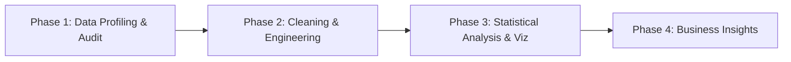

# 📊 Orange Internship — Exploratory Data Analysis & Analytics Portfolio

[](https://www.python.org/)
[](https://pandas.pydata.org/)
[]()
[]()

Welcome to the **Orange Internship Data Analytics & Data Science Portfolio**. This repository houses structured, end-to-end **Exploratory Data Analysis (EDA)** projects covering retail commerce analytics and educational performance evaluation.

Each project follows a rigorous, industry-standard analytical framework — taking raw, uncleaned transactional data through data profiling, quality auditing, missing/outlier treatment, interactive visualization, and executive business insights.

---

## 📁 Repository Directory Architecture

The repository is organized into standardized, domain-specific modules. All subdirectories contain dedicated raw datasets, clean Jupyter notebooks, and standalone documentation.

```
orange_internship/
├── README.md                                # Root repository portfolio documentation (this file)
│
├── 01_superstore_sales_eda/                 # Project 01: Retail Superstore Sales Analytics
│   ├── README.md                            # Comprehensive project report & insights
│   ├── superstore_sales.csv                 # Raw dataset (9,800+ transactions, 18 attributes)
│   └── superstore_sales_eda.ipynb           # End-to-end data audit, cleaning & EDA notebook
│
└── 02_students_performance_eda/             # Project 02: Student Academic Examination Performance
    ├── README.md                            # Comprehensive project report & 10 key Q&A findings
    ├── students_performance.csv             # Raw dataset (1,000 student records, 8 attributes)
    └── students_performance_eda.ipynb       # End-to-end statistical analysis & Plotly EDA notebook
```

---

## 📌 Portfolio Projects Overview

| Project | Domain | Dataset Scope | Primary Focus | Key Outcome | Subproject Documentation |
|---|---|---|---|---|---|
| **01. Superstore Sales EDA** | Retail & E-Commerce | ~9,800 rows × 18 cols | Retail operations, shipping efficiency, sales distribution & data quality auditing | Resolved missing postal codes, capped extreme sales outliers (Winsorization), identified Standard Class shipping dominance (~60%). | [Read Project 01 Documentation](file:///e:/data/orange_internship/01_superstore_sales_eda/README.md) |
| **02. Students Performance EDA** | Education & Demographics | 1,000 rows × 8 cols | Socio-economic impact, demographic score variance, correlation & test prep efficacy | Quantified ~10–12 pt score gap from socio-economic factors (lunch proxy) and demonstrated +5–8 pt prep course boost across all demographics. | [Read Project 02 Documentation](file:///e:/data/orange_internship/02_students_performance_eda/README.md) |

---

## 📊 Summary of Key Business Insights

### 🛒 Project 01: Superstore Sales Analysis
- **Data Quality Integrity:** Diagnosed 11 missing `Postal Code` entries strictly localized to Burlington, Vermont; populated with verified zip code `05401`. Stripped trailing whitespace across categorical fields.
- **Sales Distribution:** Highly right-skewed revenue curve ($0–$500 bulk range, with extreme transactions >$5,000). Applied Inter-Quartile Range (IQR) Winsorization to stabilize variance for downstream statistical modeling.
- **Operational Performance:** Standard Class shipping dominates 60% of volume (average lead time 3–5 days). Technology leads in average ticket size, whereas Office Supplies drives transaction frequency.

### 🎓 Project 02: Students Exam Performance Analysis
- **Socio-Economic Indicator:** Lunch type (Standard vs. Free/Reduced) proved to be the strongest predictor of exam performance, accounting for a **10–12 point average score differential** across Math, Reading, and Writing.
- **Test Preparation Lift:** Completing the test preparation course provided a consistent **5–8 point boost** across all demographic segments, effectively helping to narrow socio-economic score gaps.
- **Gender & Subject Dynamics:** Male students outperformed in Mathematics by ~5 points, while female students achieved higher scores in Reading (+7 pts) and Writing (+9 pts).
- **Subject Correlation:** Reading and Writing exam scores exhibit near-perfect collinearity ($r \approx 0.95$), suggesting shared literacy competencies.

---

## ⚙️ Standardized Analytical Methodology

Every notebook in this portfolio enforces a 4-phase data analytics framework:



1. **Phase 1 — Data Profiling & Quality Audit:**
   - Inspection of schema types (`dtypes`), null value distributions, exact duplicate rows, and string whitespace/casing inconsistencies.
2. **Phase 2 — Cleaning & Feature Engineering:**
   - Deterministic null imputation, standardized `snake_case` column naming, IQR outlier detection & Winsorization, and derived features (`total_score`, `average_score`, `result`, `grade`, `shipping_duration`).
3. **Phase 3 — Visual & Distribution Analysis:**
   - Univariate distribution profiling (KDE histograms, box plots, skewness/kurtosis quantification) and bivariate/multivariate cross-tabulations (correlation heatmaps, pair plots, sunburst diagrams).
4. **Phase 4 — Insights & Strategic Recommendations:**
   - Translating statistical findings into non-technical executive takeaways and actionable business recommendations.

---

## 🛠️ Technology Stack & Libraries

| Library / Tool | Category | Usage & Purpose |
|---|---|---|
| **Python 3.10+** | Core Language | Data manipulation & execution environment |
| **pandas** | Data Analysis | DataFrame transformations, string cleaning, aggregation |
| **numpy** | Numerical Computing | Vectorized operations & array handling |
| **plotly.express / graph_objects** | Interactive Visualization | Dark-themed interactive charts, heatmaps, subplots & sunbursts |
| **seaborn & matplotlib** | Statistical Visualization | Static distribution plots, marginal box plots & KDE curves |
| **scipy & statsmodels** | Statistical Tools | Skewness, kurtosis & distribution analysis |
| **Jupyter Notebook** | Environment | Interactive markdown-rich analysis notebook delivery |

---

## 🚀 Getting Started & Execution

### 1. Clone the Repository
```bash
git clone https://github.com/your-username/orange_internship.git
cd orange_internship
```

### 2. Set Up Virtual Environment & Dependencies
```bash
# Create virtual environment
python -m venv venv

# Activate environment (Windows)
.\venv\Scripts\activate

# Activate environment (macOS/Linux)
source venv/bin/activate

# Install required packages
pip install pandas numpy matplotlib seaborn plotly scipy statsmodels jupyter
```

### 3. Launch & Run Notebooks

To run **Project 01 (Superstore Sales EDA)**:
```bash
cd 01_superstore_sales_eda
jupyter notebook superstore_sales_eda.ipynb
```

To run **Project 02 (Students Performance EDA)**:
```bash
cd 02_students_performance_eda
jupyter notebook students_performance_eda.ipynb
```

Select **Kernel > Restart & Run All** in Jupyter to execute the pipeline end-to-end.

---

## 📜 Code Governance & Quality Standards

- **Naming Standards:** Directories (`0X_description`), Datasets (`snake_case.csv`), Notebooks (`domain_eda.ipynb`), Variables (`snake_case`).
- **Reproducibility:** Self-contained file loading logic supporting local execution, Google Colab, and Kaggle environments.
- **Narrative Structure:** Every code block is preceded by markdown context explaining the analytical objective and expected outcome.

